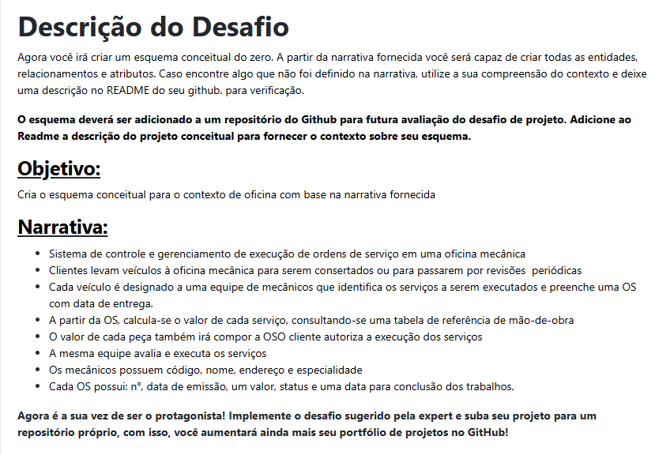
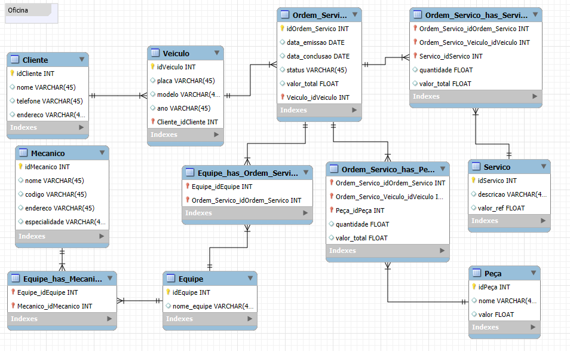

# Projeto Conceitual de Banco de Dados – Oficina

Este projeto foi desenvolvido como parte do desafio da **Digital Innovation One (DIO)** no bootcamp, com o objetivo de criar um modelo conceitual de banco de dados voltado para um sistema de oficina.

---

## 📌 Contexto

O modelo representa um sistema de oficina que gerencia **clientes, veículos, mecânicos, equipe, serviço, peça e ordem de serviço**.

O ponto de partida foi a narrativa disponibilizada no desafio:

---

## 📊 Modelo Conceitual

Abaixo está a representação do diagrama criado:

---

## 🚀 Como Utilizar

1. O diagrama foi construído no **MySQL Workbench**.  
2. O arquivo `.mwb` presente em '/workbench_diagram/diagram_oficina.mwb' pode ser aberto no Workbench para futuras alterações.  
3. Caso necessário, o modelo pode ser traduzido para **modelo lógico/físico (DDL SQL)**.  

---

Desenvolvido como parte do bootcamp da [Digital Innovation One](https://www.dio.me/).
